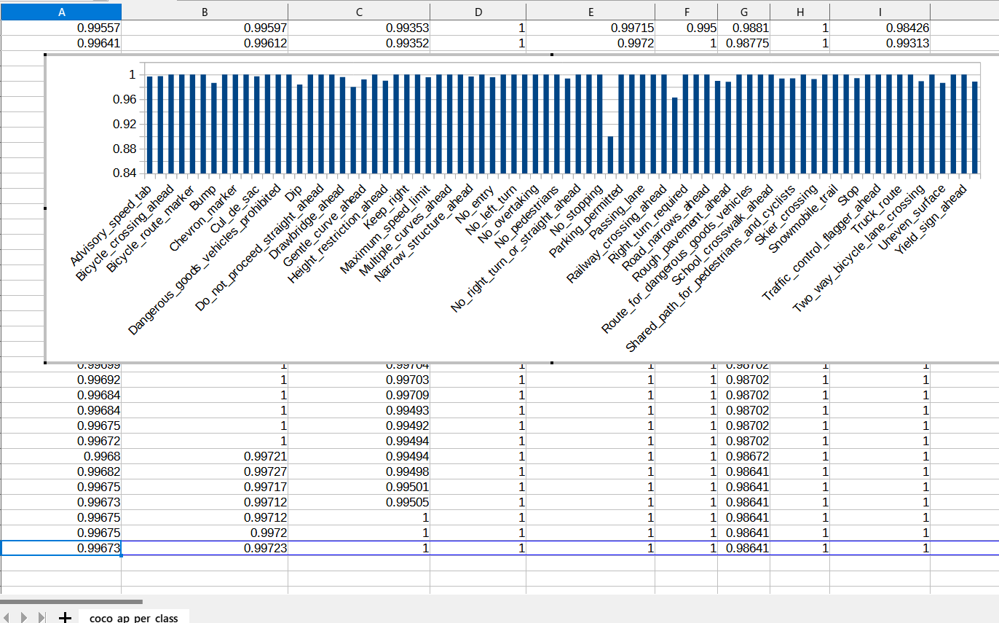

<h2>
EfficientDet-Slightly-Realistic-CA-RoadSigns-78classes (Updated: 2023/02/22)
</h2>

<h2>
1. Installing tensorflow on Windows11
</h2>
We use Python 3.8.10 to run tensoflow 2.8.0 on Windows11. 
<h3>1.1 Install Microsoft Visual Studio Community</h3>
Please install <a href="https://visualstudio.microsoft.com/ja/vs/community/">Microsoft Visual Studio Community</a>, 
which can be ITed to compile source code of 
<a href="https://github.com/cocodataset/cocoapi">cocoapi</a> for PythonAPI. 
<h3>1.2 Create a python virtualenv </h3>
Please run the following command to create a python virtualenv of name <b>py38-efficientdet</b>.
<pre>
>cd c:\
>python38\python.exe -m venv py38-efficientdet
>cd c:\py38-efficientdet
>./scripts/activate
</pre>
<h3>1.3 Create a working folder </h3>
Please create a working folder "c:\google" for your repository, and install the python packages. 

<pre>
>mkdir c:\google
>cd    c:\google
>pip install cython
>git clone https://github.com/cocodataset/cocoapi
>cd cocoapi/PythonAPI
</pre>
You have to modify extra_compiler_args in setup.py in the following way:
<pre>
   extra_compile_args=[]
</pre>
<pre>
>python setup.py build_ext install
</pre>

 
<h2>
2. Installing EfficientDet-Realistic-CA-RoadSigns-78classes
</h2>
<h3>2.1 Clone repository</h3>
Please clone EfficientDet-Slightly-Realistic-CA-RoadSigns-78classes.git in the working folder <b>c:\google</b>. 
<pre>
>git clone https://github.com/sarah-antillia/EfficientDet-Slightly-Realistic-CA-RoadSigns-78classes.git 
</pre>
You can see the following folder <b>projects</b> in  EfficientDet-Slightly-Realistic-CA-RoadSigns-78classes of the working folder. 

<pre>
EfficientDet-Slightly-Realistic-CA-RoadSigns-78classes
└─projects
    └─CA_RoadSigns
        ├─eval
        ├─saved_model
        │  └─variables
        ├─realistic_test_dataset
        └─realistic_test_dataset_outputs
</pre>
<h3>2.2 Install python packages</h3>

Please run the following command to install python packages for this project. 
<pre>
>cd ./EfficientDet-Slightly-Realistic-CA-RoadSigns-78classes
>pip install -r requirements.txt
</pre>

 
<h3>2.3 Create TFRecord dataset</h3>
 You can create TRecord_CA_RoadSigns 78classe dataset by using the following project 
<a href="https://github.com/sarah-antillia/Realistic-AutoAnnotation-Tool/tree/main/projects/CA_RoadSigns_78classes">Realistic-AutoAnnotation-Tool</a>
 
The created train and valid TFRecord dataset must be copied into ./projects/CA_RoadSigns folder.
<pre>
└─projects
    └─CA_RoadSigns
        ├─train
        └─valid
</pre>
The train and valid folders contain the following tfrecord files: 
<pre>
    └─CA_RoadSigns
        ├─train
        │  └─train.tfrecord
        │  └─mixed_size_train.tfrecord
        └─valid
           └─valid.tfrecord
           └─mixed_size_valid.tfrecord

</pre>

<h3>2.4 Workarounds for Windows</h3>
As you know or may not know, the efficientdet scripts of training a model and creating a saved_model do not 
run well on Windows environment in case of tensorflow 2.8.0 (probably after the version 2.5.0) as shown below:. 
<pre>
INFO:tensorflow:Saving checkpoints for 0 into ./models\model.ckpt.
I0609 06:22:50.961521  3404 basic_session_run_hooks.py:634] Saving checkpoints for 0 into ./models\model.ckpt.
2022-06-09 06:22:52.780440: W tensorflow/core/framework/op_kernel.cc:1745] OP_REQUIRES failed at save_restore_v2_ops.cc:110 :
 NOT_FOUND: Failed to create a NewWriteableFile: ./models\model.ckpt-0_temp\part-00000-of-00001.data-00000-of-00001.tempstate8184773265919876648 :
</pre>

The real problem seems to happen in the original <b> save_restore_v2_ops.cc</b>. The simple workarounds to the issues are 
to modify the following tensorflow/python scripts in your virutalenv folder. 
<pre>
c:\py38-efficientdet\Lib\site-packages\tensorflow\python\training
 +- basic_session_run_hooks.py
 
634    logging.info("Saving checkpoints for %d into %s.", step, self._save_path)
635    ### workaround date="2022/06/18" os="Windows"
636    import platform
637    if platform.system() == "Windows":
638      self._save_path = self._save_path.replace("/", "\\")
639    #### workaround
</pre>

<pre>
c:\py38-efficientdet\Lib\site-packages\tensorflow\python\saved_model
 +- builder_impl.py

595    variables_path = saved_model_utils.get_variables_path(self._export_dir)
596    ### workaround date="2022/06/18" os="Windows" 
597    import platform
598    if platform.system() == "Windows":
599      variables_path = variables_path.replace("/", "\\")
600    ### workaround
</pre>
 
<h3>3. Inspect tfrecord</h3>
  Move to ./projects/CA_RoadSigns directory, and run the following bat file: 
<pre>
tfrecord_inspect.bat
</pre>
, which is the following:
<pre>
python ../../TFRecordInspector.py ^
  ./train/*.tfrecord ^
  ./label_map.pbtxt ^
  ./Inspector/train
</pre>
 
This will generate annotated images with bboxes and labels from the tfrecord, and cout the number of annotated objects in it. 
 
<b>TFRecordInspecotr: annotated images in train.tfrecord</b> 

 
 
<b>TFRecordInspecotr: objects_count train.tfrecord</b> 

 
This bar graph shows that the number of the objects contained in train.tfrecord.
 
 
 
<h3>4. Downloading the pretrained-model efficientdet-d0</h3>
Please download an EfficientDet model chekcpoint file <b>efficientdet-d0.tar.gz</b>, and expand it in <b>EfficientDet-CA-RoadSigns</b> folder. 
 
https://storage.googleapis.com/cloud-tpu-checkpoints/efficientdet/coco2/efficientdet-d0.tar.gz
 
See: https://github.com/google/automl/tree/master/efficientdet 

<h3>5. Training CA RoadSigns Model by using pretrained-model</h3>
Please change your current directory to <b>./projects/CA_RoadSigns</b>,
and run the following bat file to train CA-Roadsigns Efficientdet Model by using the train and valid tfrecords.
<pre>
1_train.bat
</pre>

<pre>
rem 1_train.bat: modified --model_dir
python ../../ModelTrainer.py ^
  --mode=train_and_eval ^
  --train_file_pattern=./train/*.tfrecord  ^
  --val_file_pattern=./valid/*.tfrecord ^
  --model_name=efficientdet-d0 ^
  --hparams="input_rand_hflip=False,image_size=512x512,num_classes=78,label_map=./label_map.yaml" ^
  --model_dir=./models ^
  --label_map_pbtxt=./label_map.pbtxt ^
  --eval_dir=./eval ^
  --ckpt=../../efficientdet-d0  ^
  --train_batch_size=4 ^
  --early_stopping=map ^
  --patience=10 ^
  --eval_batch_size=1 ^
  --eval_samples=1000  ^
  --num_examples_per_epoch=2000 ^
  --num_epochs=80 
</pre>

<table style="border: 1px solid #000;">
<tr>
<td>
--mode</td><td>train_and_eval</td>
</tr>
<tr>
<td>
--train_file_pattern</td><td>./train/*.tfrecord</td>
</tr>
<tr>
<td>
--val_file_pattern</td><td>./valid/*.tfrecord</td>
</tr>
<tr>
<td>
--model_name</td><td>efficientdet-d0</td>
</tr>
<tr><td>
--hparams</td><td>"input_rand_hflip=False,num_classes=78,label_map=./label_map.yaml"
</td></tr>
<tr>
<td>
--model_dir</td><td>./models</td>
</tr>
<tr><td>
--label_map_pbtxt</td><td>./label_map.pbtxt
</td></tr>

<tr><td>
--eval_dir</td><td>./eval
</td></tr>

<tr>
<td>
--ckpt</td><td>../../efficientdet-d0</td>
</tr>
<tr>
<td>
--train_batch_size</td><td>4</td>
</tr>
<tr>
<td>
--early_stopping</td><td>map</td>
</tr>
<tr>
<td>
--patience</td><td>10</td>
</tr>

<tr>
<td>
--eval_batch_size</td><td>1</td>
</tr>
<tr>
<td>
--eval_samples</td><td>1000</td>
</tr>
<tr>
<td>
--num_examples_per_epoch</td><td>2000</td>
</tr>
<tr>
<td>
--num_epochs</td><td>100</td>
</tr>
</table>
 
 
<b>label_map.yaml:</b>
<pre>
1: 'Advisory_speed_tab'
2: 'Approaching_an_intersection'
3: 'Bicycle_crossing_ahead'
4: 'Bicycle_parking'
5: 'Bicycle_route_marker'
6: 'Bike_lane'
7: 'Bump'
8: 'Bus_lane'
9: 'Chevron_marker'
10: 'Crosswalk_with_flashing_lights_ahead'
11: 'Cul_de_sac'
12: 'Cyclists_must_dismount_their_bikes_and_walk'
13: 'Dangerous_goods_vehicles_prohibited'
14: 'Deer_area'
15: 'Dip'
16: 'Disaster_response_route'
17: 'Do_not_proceed_straight_ahead'
18: 'Double_curve_ahead'
19: 'Drawbridge_ahead'
20: 'End_of_road'
21: 'Gentle_curve_ahead'
22: 'Hairpin_curve_ahead'
23: 'Height_restriction_ahead'
24: 'Keep_left'
25: 'Keep_right'
26: 'Left_turn_required'
27: 'Maximum_speed_limit'
28: 'Motorists_must_not_pass_cyclists'
29: 'Multiple_curves_ahead'
30: 'Must_proceed_straight'
31: 'Narrow_structure_ahead'
32: 'No_bicycles'
33: 'No_entry'
34: 'No_left_turn_or_straight_ahead'
35: 'No_left_turn'
36: 'No_littering'
37: 'No_overtaking'
38: 'No_parking'
39: 'No_pedestrians'
40: 'No_right_turn_on_red'
41: 'No_right_turn_or_straight_ahead'
42: 'No_right_turn'
43: 'No_stopping'
44: 'One_way'
45: 'Parking_permitted'
46: 'Parking'
47: 'Passing_lane'
48: 'Pedestrian_crosswalk_ahead'
49: 'Railway_crossing_ahead'
50: 'Railway_crossing'
51: 'Right_turn_required'
52: 'Road_closed'
53: 'Road_narrows_ahead'
54: 'Road_surface_slippery_when_wet'
55: 'Rough_pavement_ahead'
56: 'Roundabout_ahead'
57: 'Route_for_dangerous_goods_vehicles'
58: 'School_bus_stop_ahead'
59: 'School_crosswalk_ahead'
60: 'School_zone'
61: 'Shared_path_for_pedestrians_and_cyclists'
62: 'Sharp_curve_ahead'
63: 'Skier_crossing'
64: 'Slow'
65: 'Snowmobile_trail'
66: 'Stop_ahead'
67: 'Stop'
68: 'Traffic_calmed_neighborhood'
69: 'Traffic_control_flagger_ahead'
70: 'Traffic_signal_ahead'
71: 'Truck_route'
72: 'Turn_left_or_right'
73: 'Two_way_bicycle_lane_crossing'
74: 'Two_way_traffic'
75: 'Uneven_surface'
76: 'Watch_for_fallen_or_falling_rocks'
77: 'Yield_sign_ahead'
78: 'Yield'
</pre>
 
 
<b><a href="./projects/CA_RoadSigns/eval/coco_metrics.csv">COCO metrics at epoch 100</a></b> 

 

 
<b><a href="./projects/CA_RoadSigns/eval/coco_metrics.csv">COCO meticss f and map</a></b> 

 
 
<b><a href="./projects/CA_RoadSigns/eval/train_losses.csv">Train losses</a></b> 

 
 

<b><a href="./projects/CA_RoadSigns/eval/coco_ap_per_class.csv">COCO ap per class</a></b> 

 

<h3>
6. Create a saved_model from the checkpoint
</h3>
  Please run the following bat file to create a saved_model from the checkpoint files in <b>./models</b> folder.  
<pre>
2_create_saved_model.bat
</pre>
, which is the following:
<pre>
rem 2_create_saved_model.bat  
python ../../SavedModelCreator.py ^
  --runmode=saved_model ^
  --model_name=efficientdet-d0 ^
  --ckpt_path=./models  ^
  --hparams="image_size=512x512,num_classes=78" ^
  --saved_model_dir=./saved_model
</pre>

<table style="border: 1px solid #000;">
<tr>
<td>--runmode</td><td>saved_model</td>
</tr>

<tr>
<td>--model_name </td><td>efficientdet-d0 </td>
</tr>

<tr>
<td>--ckpt_path</td><td>./models</td>
</tr>

<tr>
<td>--hparams</td><td>"image_size=512x512,num_classes=78"</td>
</tr>

<tr>
<td>--saved_model_dir</td><td>./saved_model</td>
</tr>
</table>

 
 
<h3>
7. Inference IT_road_signs by using the saved_model
</h3>
<h3>7.1 Inference scripts</h3>
 Please run the following bat file to infer the roadsigns in images of test_dataset:
<pre>
3_inference.bat
</pre>
, which is the folllowing:
<pre>
rem 3_inference.bat
python ../../SavedModelInferencer.py ^
  --runmode=saved_model_infer ^
  --model_name=efficientdet-d0 ^
  --saved_model_dir=./saved_model ^
  --min_score_thresh=0.4 ^
  --hparams="num_classes=78,label_map=./label_map.yaml" ^
  --input_image=./realistic_test_dataset/*.jpg ^
  --classes_file=./classes.txt ^
  --ground_truth_json=./realistic_test_dataset/annotation.json ^
  --output_image_dir=./realistic_test_dataset_outputs
</pre>

<table style="border: 1px solid #000;">
<tr>
<td>--runmode</td><td>saved_model_infer </td>
</tr>
<tr>
<td>--model_name</td><td>efficientdet-d0 </td>
</tr>

<tr>
<td>--saved_model_dir</td><td>./saved_model </td>
</tr>

<tr>
<td>--min_score_thresh</td><td>0.4 </td>
</tr>

<tr>
<td>--hparams</td><td>"num_classes=78,label_map=./label_map.yaml"</td>
</tr>

<tr>
<td>--input_image</td><td>./realistic_test_dataset/*.jpg</td>
</tr>

<tr>
<td>--classes_file</td><td>./classes.txt</td>
</tr>

<tr>
<td>--ground_truth_json</td><td>./realistic_test_dataset/annotation.json</td>
</tr>

<tr>
<td>--output_image_dir</td><td>./realistic_test_dataset_outputs</td>
</tr>
</table>

 
<h3>
7.2. Some Inference results of CA RoadSigns
</h3>
 
<a href="./projects/CA_RoadSigns/realistic_test_dataset_outputs/ca_roadsigns_1001.jpg_objects.csv">roadsigns1001.jpg_objects.csv</a> 
 
 
<a  href="./projects/CA_RoadSigns/realistic_test_dataset_outputs/ca_roadsigns_1012.jpg_objects.csv">roadsigns1002.jpg_objects.csv</a> 
 
 
<a  href="./projects/CA_RoadSigns/realistic_test_dataset_outputs/ca_roadsigns_1023.jpg_objects.csv">roadsigns1003.jpg_objects.csv</a> 
 
 
<a  href="./projects/CA_RoadSigns/realistic_test_dataset_outputs/ca_roadsigns_1034.jpg_objects.csv">roadsigns1004.jpg_objects.csv</a> 
 
 
<a  href="./projects/CA_RoadSigns/realistic_test_dataset_outputs/ca_roadsigns_1045.jpg_objects.csv">roadsigns1005.jpg_objects.csv</a> 
 
 
<a  href="./projects/CA_RoadSigns/realistic_test_dataset_outputs/ca_roadsigns_1056.jpg_objects.csv">roadsigns1006.jpg_objects.csv</a> 
 
 
<a  href="./projects/CA_RoadSigns/realistic_test_dataset_outputs/ca_roadsigns_1067.jpg_objects.csv">roadsigns1007.jpg_objects.csv</a> 
 
 
<a  href="./projects/CA_RoadSigns/realistic_test_dataset_outputs/ca_roadsigns_1078.jpg_objects.csv">roadsigns1008.jpg_objects.csv</a> 
 
 
<a  href="./projects/CA_RoadSigns/realistic_test_dataset_outputs/ca_roadsigns_1089.jpg_objects.csv">roadsigns1009.jpg_objects.csv</a> 
 
 
<a  href="./projects/CA_RoadSigns/realistic_test_dataset_outputs/ca_roadsigns_1099.jpg_objects.csv">roadsigns1010.jpg_objects.csv</a> 
 

<h3>7.3. COCO metrics of inference result</h3>
The 3_inference.bat computes also the COCO metrics(f, map, mar) to the <b>realistic_test_dataset</b> as shown below: 
<a href="./projects/CA_RoadSigns/realistic_test_dataset_outputs/prediction_f_map_mar.csv">prediction_f_map_mar.csv</a>

 
 
